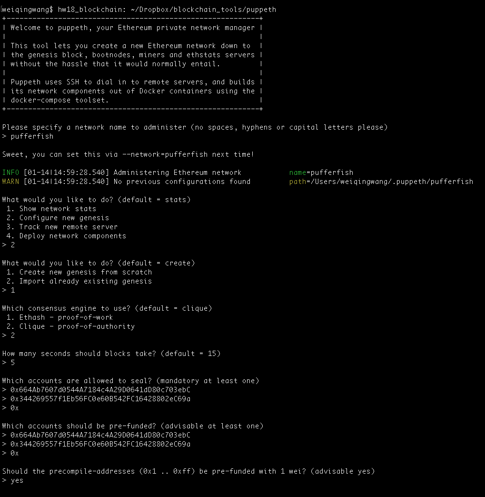
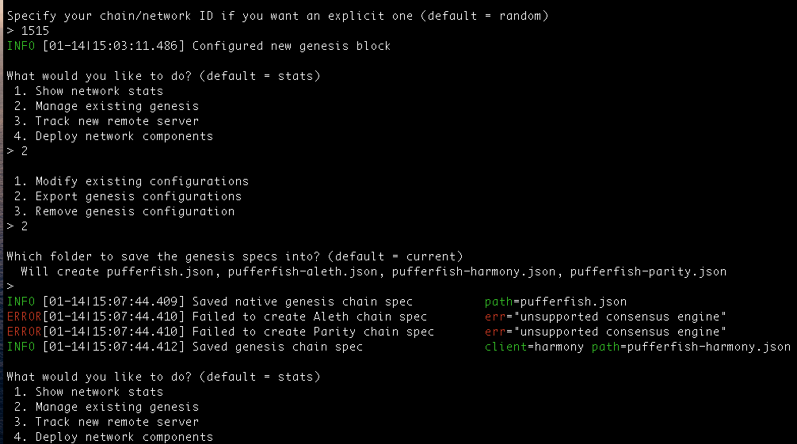
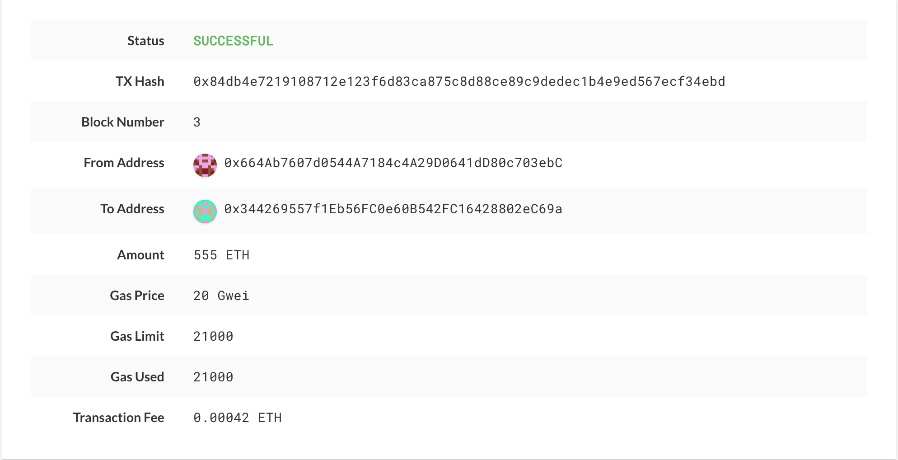

# hw18_blockchain

1. create new nodes
```~/Dropbox/blockchain_tools/geth account new --datadir node1```
```~/Dropbox/blockchain_tools/geth account new --datadir node2```

2. create genesis block




3. initialize nodes
```~/Dropbox/blockchain_tools/geth init pufferfish.json --datadir node1```
```~/Dropbox/blockchain_tools/geth init pufferfish.json --datadir node2```

4. run the first node

```~/Dropbox/blockchain_tools/geth --datadir node1 --unlock "664ab7607d0544a7184c4a29d0641dd80c703ebc" --mine --rpc --allow-insecure-unlock```
```~/Dropbox/blockchain_tools/geth --datadir node2 --unlock "344269557f1eb56fc0e60b542fc16428802ec69a" --mine --port 30304 --minerthreads 1 --bootnodes “enode://01ddcbdd455077e8d32de69b21b69f7a9fa1fa22eb69e6ea71db7b07e206b0bac0bfd734bceafc4aa7056021647b914924fe28916df58eaf77e3cdb0f94082f9@127.0.0.1:30303” ```

5. send transactions from node1 to node2




